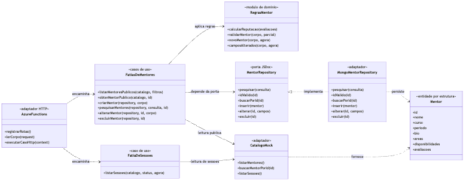
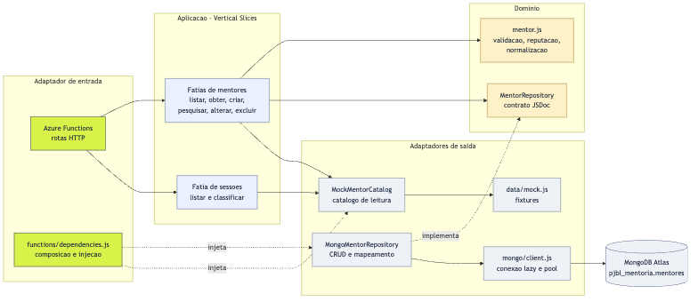

# TDE 2 - Vertical Slice, Clean Architecture e SOLID

**Projeto:** Veterano. - Plataforma de Mentoria entre Veteranos e Calouros | **Disciplina:** Arquitetura e Soluções em Cloud - PUCPR | **Repositório:** [ViniMTrevisan/pjbl-mentoria-cloud](https://github.com/ViniMTrevisan/pjbl-mentoria-cloud)
**Branch desta entrega:** `tde2-vertical-slice-clean-architecture`

## Escopo

O backend existente foi organizado por caso de uso sem alterar os endpoints usados pelo frontend. O catálogo público continua mock e o cadastro de mentores continua persistido no MongoDB Atlas. As Azure Functions passaram a adaptar HTTP e encaminhar para os casos de uso; regras de domínio e acesso ao banco ficam fora dos handlers.

## Arquitetura aplicada

```text
api/src/
  domain/mentor.js                  regras puras e validações de mentor
  features/mentors/                 uma fatia por operação de mentor
  features/sessions/                fatia de listagem de sessões
  ports/MentorRepository.js         contrato estrutural da persistência
  infrastructure/mock/              adaptador do catálogo de dados mock
  infrastructure/mongo/             adaptador MongoDB e conexão reutilizável
  functions/                         Azure Functions, composição e HTTP
  data/mock.js                       fixtures, sem lógica de aplicação
```

**Direção das dependências:** Azure Functions -> fatia de aplicação -> regras/portas -> adaptadores. O MongoDB SDK é usado apenas no adaptador Mongo. A aplicação recebe catálogo e repositório por injeção; as regras de domínio não importam Azure Functions nem MongoDB.

### Fatias de caso de uso

| Fatia | Responsabilidade |
|---|---|
| `features/mentors/listPublicMentors.js` | Filtrar catálogo público, calcular reputação e ordenar resultados. |
| `features/mentors/getPublicMentor.js` | Obter o perfil público ou responder 404. |
| `features/mentors/createMentor.js` | Validar e inserir mentor. |
| `features/mentors/searchMentors.js` | Pesquisar no Mongo, por texto ou identificador. |
| `features/mentors/updateMentor.js` | Validar atualização parcial e alterar mentor. |
| `features/mentors/deleteMentor.js` | Excluir mentor e tratar identificador inexistente. |
| `features/sessions/listSessions.js` | Filtrar e separar sessões próximas e históricas. |

### Endpoints preservados

| Rota | Caso de uso | Origem |
|---|---|---|
| `GET /api/mentores` | Listar mentores públicos | Mock |
| `GET /api/mentores/{id}` | Obter perfil público | Mock |
| `GET /api/sessoes?status=` | Listar sessões | Mock |
| `GET /api/health` | Health check | Azure Functions |
| `POST /api/mentores-db` | Criar mentor | MongoDB |
| `GET /api/mentores-db?q=&id=` | Pesquisar mentores | MongoDB |
| `PUT|PATCH /api/mentores-db/{id}` | Alterar campos enviados | MongoDB |
| `DELETE /api/mentores-db/{id}` | Excluir mentor | MongoDB |

Validação continua devolvendo 400, registro ausente 404 e falha de persistência 500. Mensagens internas do driver não são retornadas ao cliente. O CRUD permanece `authLevel: anonymous`, como na aplicação atual; esta entrega não altera autenticação nem publica/deploya os serviços.

## Princípios SOLID no código

- **S - Responsabilidade única:** handlers cuidam do protocolo HTTP; fatias coordenam um caso de uso; `mentor.js` guarda regras; repositório Mongo executa persistência.
- **O - Aberto/fechado:** o caso de uso recebe um repositório por contrato estrutural. Um novo adaptador de persistência pode ser conectado sem reescrever o handler ou as regras.
- **L - Substituição de Liskov:** o adaptador implementa os métodos definidos na porta e pode substituí-la desde que mantenha resultados e erros esperados. A aplicação não depende de `MongoMentorRepository` diretamente.
- **I - Segregação de interfaces:** o catálogo mock atende somente leituras públicas; a porta Mongo contém operações do cadastro. Cada consumidor recebe apenas a dependência necessária.
- **D - Inversão de dependência:** regras e casos de uso recebem portas; `functions/dependencies.js` instancia os adaptadores concretos na borda.

## Diagramas do backend

Os diagramas usam Mermaid como fonte editável e SVG como imagem. O diagrama de classes é conceitual: o projeto usa JavaScript, funções e objetos estruturais, sem classes de domínio declaradas com a palavra-chave `class`.

### Classes, módulos e contratos



Fonte: [`tde2-backend-classes.mmd`](diagramas/tde2-backend-classes.mmd).

### Componentes e direção das dependências



Fonte: [`tde2-backend-componentes.mmd`](diagramas/tde2-backend-componentes.mmd).

## Alunos do grupo e divisão sugerida para validação

O cadastro do projeto lista Bento Barp, Guilherme Reis, Guilherme Selenko e Vinicius Trevisan. O histórico do repositório não atribui tarefas individuais para esta etapa. A tabela abaixo é uma proposta de divisão; cada integrante deve validá-la antes de ser apresentada como registro factual da participação.

| Aluno | Contribuição proposta nesta etapa |
|---|---|
| Bento Barp | Revisar as regras de negócio de mentores e sessões e conferir se os contratos existentes foram preservados. |
| Guilherme Reis | Revisar as fatias de CRUD, a porta de repositório e o mapeamento para MongoDB. |
| Guilherme Selenko | Revisar os diagramas de classes/componentes e a relação entre Clean Architecture, Vertical Slice e SOLID. |
| Vinicius Trevisan | Integrar a alteração ao repositório, validar a branch e consolidar a documentação e o PDF. |

**Nota de autoria:** a implementação foi assistida por IA generativa. A divisão acima é sugestão para revisão do grupo, não comprovação de atividades já realizadas por cada aluno.

## Verificação local registrada

Foi feita validação sintática dos arquivos JavaScript com `node --check`. Os diagramas são renderizados pelo Mermaid CLI e o PDF é renderizado em PNG para inspeção visual. Não houve teste contra MongoDB, Azure, nem deploy nesta etapa.

## Prompts

Os prompts utilizados nesta alteração estão reproduzidos em [`TDE2-PROMPTS.md`](TDE2-PROMPTS.md) e também no PDF de entrega.
